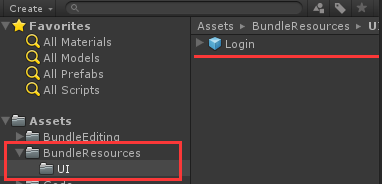

# 资源模块做什么？

资源模块——ResourceModule，是KEngine中最核心的模块，其他模块基本或多或少的对它有依赖，它主要的功能是：**资源打包、路径定义、资源管理、资源调试**。

资源模块对Unity的Asset Bundle接口进行了完整的封装，运行模式下可以使用它进行完整的资源加载、卸载，也可以通过它方便地查找资源内存泄露的问题。

# AssetBundle自动化打包

Unity 5中，Asset Bundle系统做了很大的变化。你只需将需要打包的资源配置AssetBundle Name，然后执行接口BuildPipeline.BuildAssetBundles(outputPath)就完成了所有AssetBundle的打包，比Unity 4.x方便多了。




在KEngine+Unity 5.x中，把配置AssetBundle Name的这一步也省掉了。你只需把需要打包的资源，放在Assets/BundleResources目录中，所有的AssetBundle将会完整导出。


# 路径定义

Unity跨平台开发中，针对不同的平台——如编辑器、安卓、IOS、Windows等，一般有不同的资源存放路径。

像生成的Asset Bundle，还需要针对不同的平台，生成完全不一样的Asset Bundle资源。

因而KEngine中分别对Unity中的StreamingAssetsPath、PersistentDataPath等做了封装，开发人员无需为资源放在什么目录进行烦恼了（详见ResourceModule中的InitResourcePath方法），并且，内置了支持热更新。

## 举例：加载一个Asset Bundle的路径选择

假设现在要加载一个UI资源"Login"：
```csharp
        public IEnumerator LoadUIAsset(CUILoadState loadState, UILoadRequest request)
        {
            string path = string.Format("ui/login.prefab.bytes"));
            var assetLoader = KStaticAssetLoader.Load(path);
            while (!assetLoader.IsCompleted)
                yield return null;

            request.Asset = assetLoader.TheAsset;  // Asset 是GameObject
        }
```

这个StaticAssetLoader，做了什么操作？假设我们在Android平台
- 获知ui/login.prefab.bytes这个路径
- 寻找热更新资源，尝试加载PersistentAssetsPath/Bundles/Android/ui/logins.prefabs.bytes
- 无法找到热更新资源，尝试加载StreamingAssetsPath/Bundles/Android/ui/logins.prefabs.bytes
- 依然无法找到，加载失败


# 资源加载

KEngine在Unity 5.x中，会自动的先加载依赖资源，你只要填入Asset Bundle的路径名字就可以了。就像Unity的Resources类一样。


## 简单加载
使用ResourceModule中的LoadBundle、LoadBundleAsync接口，可以实现类似于Unity的Resources.Load、Resources.LoadAsync的效用。


要注意的是，LoadBundle、LoadBundleAsync接口，起始地址是加载StreamingAssets/Bundles/Win32或StreamingAssets/Bundles/Android这种平台相关的路径。

```csharp
// 同步加载，返回加载器，加载器中有加载的资源
var reqeust = ResourceModule.LoadBundle("ui/login.prefab.bytes")
Debug.Log(request.Asset != null); // true

// 异步加载，返回加载器，加载器中还没加载的资源，需要异步等待
var request = ResourceModule.LoadBundleAsync("ui/login.prefab.bytes", (isOk, asset, args)=>{});
Debug.Log(request.Asset == null); // true
```

## Loader加载器

KEngine中定义了各种类型的资源加载器，提供更为方便的加载、调试功能，来避免一些使用上的。坑

### 加载GameObject

最常用的Loader有两个：
- StaticAsset：每次调用Load，使用同一份GameObject引用
- InstanceAsset：每次调用Load，都会拷贝出一份GameObject

```csharp
       // 协程风格
        public IEnumerator LoadUIAsset(UILoadRequest request)
        {
            string path = string.Format("ui/login.prefab.bytes"));
            var assetLoader = KStaticAssetLoader.Load(path);
            while (!assetLoader.IsCompleted)
                yield return null;

            request.Asset = assetLoader.TheAsset;  // Asset 是GameObject
        }
```
```csharp
       // CPS回调风格
        public void LoadUIAsset(UILoadRequest request)
        {
            string path = string.Format("ui/login.prefab.bytes"));
            KStaticAssetLoader.Load(path, (isOk, asset, args)=>{
                request.Asset =asset;
            });
        }
```

### 资源的释放

KEngine中的资源释放，跟Unity的资源释放明显区别是：Unity中提供Resources.UnloadUnusedAssets接口，来自动释放无用的资源的。而KEngine中资源释放采用纯手动的方式。  

这主要是因为躺过Unity自动释放资源的很多坑： 经常会遇到“missing”的资源引用吧？因此选择了手动释放机制。

所有XXXLoader，都有一个接口Loader.Release()，举例：
```csharp
            string path = string.Format("ui/login.prefab.bytes"));
            var assetLoader = KStaticAssetLoader.Load(path);  // 引用计数1
            while (!assetLoader.IsCompleted)
                yield return null;
            var assetLoader2 = KStaticAssetLoader.Load(path);  // 引用计数2
            while (!assetLoader2.IsCompleted)
                yield return null;

            assetLoader2.Release(); // 释放，减小引用计数  // 引用计数1
            assetLoader.Release(); // 引用计数0，正式删掉缓存的资源
```

手工释放的资源存在引用计数，只有当引用计数为0，Loader才会触发回收，并且连同加载过的AssetBundle彻底消灭，节省内存。

###  其它Loader

诸如TextureLoader、AudioLoader等等，所有XXXLoader的使用方法都是一致的，它们提供CPS回调风格和协程风格
