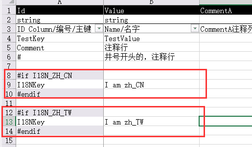

游戏开发中，经常会为不同的地区，推出不同的版本，比如中国版、英文版、日文版。 除了语言上的本地化，往往不同的地区发行商，还会提出一些自己地区版本的一些特定功能。
编程的代码，可以通过if来判断，可是，配置表这种静态的东西，却缺少if的机制来区别出不同的版本了。

KSFramework 0.9版本中，为KEngine的配置表的编译机制加入预编译指令功能，可以采用类似C#中#if预编译指令，来告诉配置表编译工具，哪些行是无需编译的：

如上图，Excel的配置过程中，可以像C#的预编译指令一样，通过#if...#endif，条件式编译来控制哪些行会被编译出去生成csv。

为预编译指令加入变量，只需修改静态数组SettingModuleEditor.CompileSettingConditionVars就可以了。可以自定义KSFrameworkCustom.cs来实现。

条件编译机制可以配合[“拆分表格机制”](guide#_4)，为同一种配置，不同的配置环境，对应不同的配置文件
